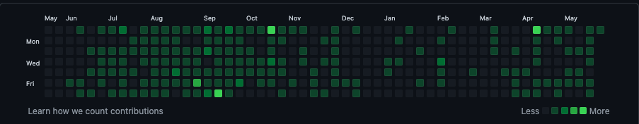

## [Hi, I am Arnab Saha](https://arnab1996.github.io/) 

[][LinkedIn]

<!--
**Arnab1996/Arnab1996** is a ✨ _special_ ✨ repository because its `README.md` (this file) appears on your GitHub profile.
-->

I am [Arnab](https://arnab1996.github.io/), a passionate and creative developer
from [🇮🇳 ](https://en.wikipedia.org/wiki/India)&nbsp;with a strong interest in Open-Source. 🎯

I mostly work with Java and Cloud-Native technologies.☁️🚀

 

### Programming Languages

  
    &nbsp;&nbsp;&nbsp;&nbsp;
  

 

### Continuous Integration & Continuous Deployment

  
  
  &nbsp;&nbsp;
  
   
   

 

### Web technologies

  <a href="https://www.w3.org/wiki/The_web_standards_model_-_HTML_CSS_and_JavaScript" target="_blank" >
    &nbsp;&nbsp;
  </a>
    <a href="https://nodejs.org/en/" target="_blank" >
    &nbsp;&nbsp;
  </a>
    
 

 

### CSPs

 

  <a href="https://azure.microsoft.com/en-in/services/app-service/web/" target="_blank" >
    &nbsp;&nbsp;&nbsp;&nbsp;
  </a> 
  
 

 

### Monitoring

 

  <a href="https://grafana.com/" target="_blank" >
    &nbsp;&nbsp;
  </a>
  

 

### Databases

 

  <a href="https://www.postgresql.org/" target="_blank" >
    &nbsp;&nbsp;
  </a>
  &nbsp;
  

 

📊 Github Stats

 

### 📫 How to reach me?

⦿ Visit my [Website](https://arnab1996.github.io/) 🌐  
⦿ Connect with me on [LinkedIn](https://www.linkedin.com/in/arnabsaha1996/) 👨🏻‍💻  
⦿ Shoot Me an [Email](mailto:arnabthedragon@gmail.com) 💌  

[linkedin]: https://www.linkedin.com/in/arnabsaha1996/

<h3 align="center">Show some &nbsp;❤️&nbsp; by starring some of the repositories!</h3>
